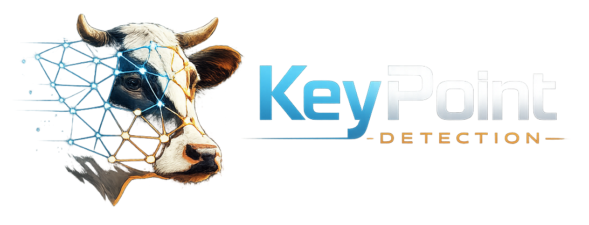
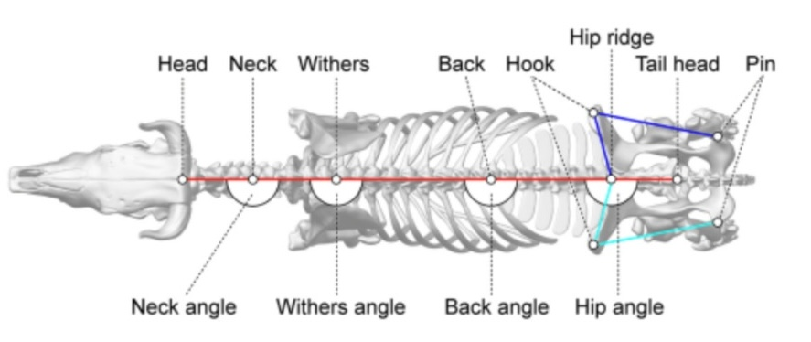

# Cows Challenge 🐄 — Keypoints + Identificação (YOLO Pose)

Projeto de visão computacional para **detecção de keypoints em vacas (vista superior)** com **YOLO Pose (Ultralytics)**, extração de **features geométricas** e **classificação/identificação** de cada vaca.

<p align="center">
  
</p>

## Objetivos

1. **Anotar** keypoints das vacas em imagens (top-view).
2. **Treinar e avaliar** um modelo **YOLO Pose**.
3. **Gerar features** a partir dos keypoints (ângulos, distâncias, proporções) que possam identificar cada animal.
4. **Analisar** descritivamente as features e sua utilidade.
5. **Treinar um classificador** usando as features (identificação da vaca).
6. **Avaliar** o modelo final.

---

## Dataset

- **30 vacas** na área de ordenha (_parlor milking station area_).
- **50 imagens por vaca** (1500 imagens no total).
- **1030 anotações** de keypoints feitas no Label Studio.

### Keypoints anotados (8 pontos, vista superior)

`withers` · `back` · `hook up` · `hook down` · `hip` · `tail head` · `pin up` · `pin down`

<p align="center">
  
</p>

### Padrões de nome de arquivo

```
cow_id_YYYY_MM_DD_HH_MM_SS_cam_ID_station_id.jpg   ← com cow_id
YYYYMMDD_HHMMSS_station_id_cam_ID.jpg               ← sem cow_id
cam_ID_XX_YYYYMMDDHHMMSS_station_id_cam_ID.jpg      ← formato RLC
```

> O parser em `src/core_utils.py` reconhece todos os 3 formatos automaticamente.

---

## Estrutura do Repositório

```text
.
├── data/
│   ├── raw_images/                 # 1029 imagens originais
│   ├── dataset_classificação/      # 30 pastas (cow_id) × 50 imagens
│   │   ├── 1106/
│   │   ├── 1122/
│   │   └── ...
│   ├── subset_yolo_pose/           # (gerado) dataset YOLO Pose
│   │   ├── images/{train,val}/
│   │   ├── labels/{train,val}/
│   │   └── data.yaml
│   └── processed/
│       └── features.csv            # (gerado) features extraídas
├── Key_points/                     # 1030 JSONs do Label Studio
├── src/
│   ├── core_utils.py               # Funções compartilhadas (NÃO executar)
│   ├── validate.py                 # 1. Validar anotações
│   ├── make_subset.py              # 2. Preparar dataset YOLO
│   ├── train_pose.py               # 3. Treinar YOLO Pose
│   ├── evaluate_pose.py            # 4. Avaliar o modelo
│   ├── extract_features.py         # 5. Extrair features geométricas
│   ├── analyze_features.py         # 6. Análise descritiva
│   ├── train_classifier.py         # 7. Treinar e avaliar classificador
│   └── predict.py                  # 8. Identificar vaca em nova imagem
├── outputs/
│   ├── models/
│   │   ├── best_pose.pt            # (gerado) modelo YOLO Pose
│   │   └── cow_classifier.joblib   # (gerado) classificador treinado
│   ├── reports/                    # (gerado) métricas e relatórios
│   └── figures/                    # (gerado) gráficos
├── docs/
├── requirements.txt
└── README.md
```

---

## 🚀 Guia Passo a Passo

### Pré-requisitos

- Python 3.10+
- Mac com Apple Silicon (M1/M2/M3/M4) para aceleração via MPS, ou GPU NVIDIA

### Passo 0 — Setup do ambiente

```bash
# Clonar o repositório
git clone <url-do-repo>
cd cow-detection

# Criar e ativar ambiente virtual
python3 -m venv .venv
source .venv/bin/activate    # Mac/Linux
# .venv\Scripts\activate     # Windows

# Instalar dependências
pip install -r requirements.txt
```

> **Dependências principais:** `ultralytics`, `numpy`, `pandas`, `scikit-learn`, `seaborn`, `matplotlib`, `opencv-python`, `pyyaml`

---

### Passo 1 — Validar as anotações

Verifica se os JSONs do Label Studio (`Key_points/`) têm todos os keypoints e se as imagens correspondentes existem em `data/raw_images/`.

```bash
source .venv/bin/activate
python3 src/validate.py
```

**Saída:** `outputs/reports/validation_report.json`

---

### Passo 2 — Preparar o dataset YOLO Pose

Filtra anotações inválidas (keypoints duplicados/ausentes), seleciona 150 amostras, divide em train/val (80/20), converte para formato YOLO Pose e copia as imagens.

```bash
python3 src/make_subset.py
```

**Saída:** `data/subset_yolo_pose/` com `images/`, `labels/` e `data.yaml`

---

### Passo 3 — Treinar o modelo YOLO Pose

Treina o modelo `yolo11n-pose` por 100 épocas usando MPS (Apple Silicon).

```bash
python3 src/train_pose.py \
    --data data/subset_yolo_pose/data.yaml \
    --epochs 100 \
    --imgsz 640
```

> ⏱️ ~17 minutos no Mac Mini M4. Se não tiver Apple Silicon, edite `src/train_pose.py` linha 49: troque `device="mps"` por `device="cpu"` ou `device="0"` (GPU NVIDIA).

**Saída:** `outputs/models/best_pose.pt`

---

### Passo 4 — Avaliar o modelo

Roda validação formal no conjunto de teste e salva métricas (mAP, Precision, Recall).

```bash
python3 src/evaluate_pose.py \
    --model outputs/models/best_pose.pt \
    --data data/subset_yolo_pose/data.yaml
```

**Saída:** `outputs/reports/metrics.json` e `outputs/reports/summary.md`

**Métricas esperadas:**

| Métrica   | Bounding Box | Keypoint Pose |
| --------- | ------------ | ------------- |
| mAP50     | 0.995        | 0.995         |
| mAP50-95  | 0.933        | 0.876         |
| Precision | 0.998        | 0.998         |
| Recall    | 1.000        | 1.000         |

---

### Passo 5 — Extrair features geométricas

Roda inferência do modelo em todas as imagens e calcula features geométricas (5 ângulos, 9 distâncias, 9 proporções normalizadas).

```bash
python3 src/extract_features.py \
    --model outputs/models/best_pose.pt \
    --images data/raw_images \
    --output data/processed/features.csv
```

**Saída:** `data/processed/features.csv` (1 linha por imagem, 39 colunas)

---

### Passo 6 — Análise descritiva das features

Gera estatísticas, histogramas, heatmap de correlação, boxplots por estação e pairplots.

```bash
python3 src/analyze_features.py \
    --input data/processed/features.csv \
    --output-dir outputs/figures \
    --report outputs/reports/feature_analysis.md
```

**Saída:**

- `outputs/figures/histograms_angles.png`
- `outputs/figures/histograms_distances.png`
- `outputs/figures/correlation_heatmap.png`
- `outputs/figures/pairplot_angles.png`
- `outputs/figures/boxplot_angle_*_by_station.png`
- `outputs/reports/feature_analysis.md`

---

### Passo 7 — Treinar e avaliar o classificador

Extrai features das 1500 imagens organizadas por cow_id (pasta `data/dataset_classificação/`), treina 3 classificadores (LogisticRegression, RandomForest, SVM) com validação cruzada 5-fold, e gera confusion matrices.

> **Pré-requisito:** A pasta `data/dataset_classificação/` deve conter 30 subpastas (uma por vaca), cada uma com ~50 imagens. O nome da pasta é o `cow_id`.

```bash
python3 src/train_classifier.py \
    --model outputs/models/best_pose.pt \
    --dataset "data/dataset_classificação" \
    --output-dir outputs
```

> ⏱️ ~2 minutos (inferência nas 1500 imagens + treino dos classificadores)

**Saída:**

- `outputs/reports/classification_results.json`
- `outputs/reports/classification_summary.md`
- `outputs/reports/classification_features.csv`
- `outputs/figures/confusion_matrix_*.png`
- `outputs/figures/feature_importance_rf.png`
- `outputs/figures/classifier_comparison.png`

**Resultados esperados:**

| Classificador      | CV Accuracy (5-fold) | Baseline (chance) |
| ------------------ | -------------------- | ----------------- |
| RandomForest       | ~22%                 | 3.3%              |
| LogisticRegression | ~20%                 | 3.3%              |
| SVM (RBF)          | ~18%                 | 3.3%              |

---

### Passo 8 — Identificar uma vaca em uma nova imagem

Após treinar o classificador (passo 7), você pode passar qualquer imagem para descobrir qual vaca está nela:

```bash
python3 src/predict.py --image caminho/para/imagem.jpg
```

**Exemplo de saída:**

```
📷 Image: 20260101_064610_baia19_IPC2.jpg
🐄 Detected 1 cow(s)
📍 Keypoints detected: 8/8

========================================
🏆 PREDICTION — Top 3
========================================
  1. Cow 1106  ████████████████████████████████░░░░░░░░░░░░░░░░░░  65.5%
  2. Cow 1397  ███░░░░░░░░░░░░░░░░░░░░░░░░░░░░░░░░░░░░░░░░░░░░░░░  7.5%
  3. Cow 1456  ███░░░░░░░░░░░░░░░░░░░░░░░░░░░░░░░░░░░░░░░░░░░░░░░  6.5%

→ Best guess: Cow **1106** (65.5% confidence)
```

**Argumentos opcionais:**

| Argumento      | Default                                | Descrição                 |
| -------------- | -------------------------------------- | ------------------------- |
| `--pose-model` | `outputs/models/best_pose.pt`          | Modelo YOLO Pose          |
| `--classifier` | `outputs/models/cow_classifier.joblib` | Classificador treinado    |
| `--top-k`      | `3`                                    | Quantas predições mostrar |
| `--conf`       | `0.25`                                 | Limiar de confiança YOLO  |

---

## Scripts auxiliares

| Script                     | Descrição                                                                               |
| -------------------------- | --------------------------------------------------------------------------------------- |
| `core_utils.py`            | Funções compartilhadas (parser de filenames, constantes). **Não executar diretamente.** |
| `predict.py`               | Identifica qual vaca está em uma imagem (requer modelo treinado)                        |
| `convert_to_yolo_pose.py`  | Conversão alternativa (dataset completo, sem subset)                                    |
| `inspect_dataset.py`       | Inspeção visual dos dados                                                               |
| `sanity_check.py`          | Checagem de sanidade do dataset                                                         |
| `visualize_predictions.py` | Visualiza predições do modelo sobre as imagens                                          |
| `debug_visualize.py`       | Debug visual com keypoints e esqueleto                                                  |
| `visualize_filtered.py`    | Visualiza amostras filtradas                                                            |

---

## Referência

> _Objective dairy cow mobility analysis and scoring system using computer vision–based keypoint detection technique from top-view 2-dimensional videos_, JDS, 2024.
> https://doi.org/10.3168/jds.2024-25545

## Checklist

- [x] Dataset em formato YOLO Pose
- [x] `data.yaml` configurado com `kpt_shape` correto
- [x] Treino YOLO Pose com `best.pt` salvo
- [x] Export de keypoints para tabela de features
- [x] Features geradas e analisadas
- [x] Classificador treinado e avaliado
